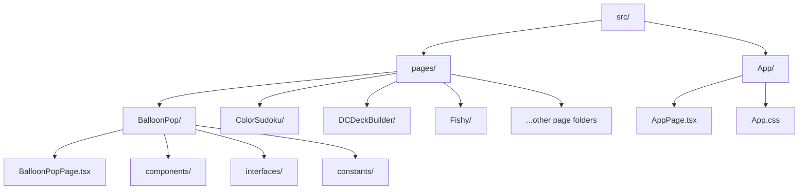
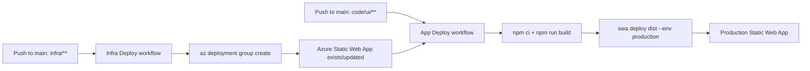

# AiApps Repository Guide

This document is the source of truth for repository structure, naming conventions, and deployment flow.

## Monorepo Layout

```text
AiApps/
|-- code/
|   `-- ui/
|       `-- my-react-app/         # React + Vite TypeScript app
|           |-- src/              # Application source
|           |-- public/           # Static public assets
|           |-- package.json      # App scripts and dependencies
|           |-- tsconfig.json     # TypeScript config
|           `-- eslint.config.js  # Lint rules
|-- infra/
|   |-- main.bicep                # Azure infra definition (Static Web App)
|   `-- main.bicepparam           # Environment parameters
|-- .github/
|   |-- workflows/
|   |   |-- infra-deploy.yml      # Deploys Bicep infra
|   |   `-- app-deploy.yml        # Builds + deploys frontend
|   `-- copilot-instructions.md
`-- AGENTS.md                     # Codex/agent execution rules
```

## Source Structure Conventions (`code/ui/my-react-app/src`)

Each routed page lives under `src/pages/` in a dedicated folder with an explicit `*Page.tsx` entry file.



Recommended page folder pattern:

```text
src/pages/<FeatureName>/
|-- <FeatureName>Page.tsx         # Required: route entry component
|-- components/                   # Optional: local reusable UI pieces
|-- interfaces/                   # Optional: feature-scoped interfaces/types
|-- constants/                    # Optional: static config/seeds/constants
|-- hooks/                        # Optional: feature-specific hooks
`-- utils/                        # Optional: pure helpers
```

## Naming and Type Conventions

1. Use TypeScript only in app source (`.tsx` for React, `.ts` for non-React).
2. Do not add new `.js` or `.jsx` files under app source.
3. Page entry files must use explicit names such as:
   - `BalloonPopPage.tsx`
   - `ColorSudokuPage.tsx`
   - `DCDeckBuilderPage.tsx`
4. Prefer explicit interfaces/types at boundaries:
   - component props
   - refs
   - state with nullable/union intent
   - utility function params/returns
5. Keep imports explicit when improving readability, for example:
   - `../pages/BalloonPop/BalloonPopPage`
   - `./components/ScoreBoard`

## Quality Gates

Run from `code/ui/my-react-app`:

```bash
npm run lint
npm run typecheck
npm run build
```

Completion requires:
1. Lint passes with zero warnings (`--max-warnings 0`).
2. Typecheck passes with no TypeScript errors.
3. Build completes successfully.

## Infrastructure Summary

Current infra in `infra/main.bicep` provisions:
1. Azure Static Web App (`Microsoft.Web/staticSites`).
2. Free SKU.
3. Outputs:
   - default hostname
   - deployment token

`infra/main.bicepparam` currently sets:
1. `location = eastus2`
2. `webAppName = myApp` (workflow overrides to `VibingWithDrake` in deployment)

## Deployment Flow



## Documentation Maintenance Rule

Update this README whenever you change:
1. folder structure
2. naming conventions
3. build/type/lint quality gates
4. infrastructure resources
5. deployment workflow behavior
